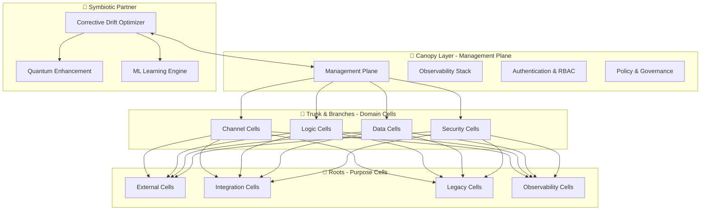

# 🌳 Black Alder Platform: Comprehensive Technical Demo
## *Grove-Based Private Cloud Infrastructure with Corrective Drift Integration*

---

## 🎯 **DEMO OVERVIEW**

This comprehensive technical demo showcases the **Black Alder Platform** - a modern, reliable private platform designed like the black alder tree with deep anchoring, coordinated growth, and clear oversight. The demo demonstrates the platform's **grove-based cell architecture** and its symbiotic integration with **Corrective Drift optimization**.

### **🌿 Key Demo Components**

| Component | Purpose | Demo Time |
|-----------|---------|-----------|
| **Platform Foundation** | Management plane with observability | 5 minutes |
| **Grove Cell Architecture** | 8 cell types deployment | 10 minutes |
| **Multi-Cloud Orchestration** | Crossplane & multi-provider | 8 minutes |
| **Corrective Drift Integration** | Optimization partnership | 10 minutes |
| **Observability Deep-dive** | eBPF, Prometheus, Grafana | 7 minutes |
| **Interactive Scenarios** | Real-world use cases | 15 minutes |

**Total Demo Duration**: 55 minutes (with Q&A)

---

## 🏗️ **DEMO ARCHITECTURE**

### **Three-Layer Grove Architecture**



### **Grove-Based Cell Types**

| Cell Type | Tree Analogy | Demo Focus | Resource Profile |
|-----------|--------------|------------|------------------|
| **Channel** | Canopy Edge | API Gateway, Load Balancing | Network-intensive |
| **Logic** | Main Branches | Business Logic, Computation | CPU-intensive |
| **Data** | Tap Roots | Storage, Analytics | Storage-intensive |
| **Security** | Bark Layer | Authentication, Compliance | Security-hardened |
| **External** | Mycorrhizal Network | Third-party Integration | Connection-based |
| **Integration** | Root Network | Workflow Orchestration | Event-driven |
| **Legacy** | Grafted Branches | Legacy System Bridge | Traditional |
| **Observability** | Sap Flow | Monitoring, Telemetry | Storage+Compute |

---

## 🚀 **DEMO DEPLOYMENT GUIDE**

### **Prerequisites**

```bash
# Infrastructure Requirements
- Kubernetes cluster (EKS, GKE, AKS, or local)
- Terraform >= 1.0
- kubectl >= 1.24
- Helm >= 3.0
- Docker (for local development)

# Resource Requirements  
- 16+ CPU cores (for full demo)
- 32GB+ RAM
- 100GB+ storage
- Multi-cloud credentials (AWS, GCP, Azure)
```

### **🌳 Phase 1: Platform Foundation (5 minutes)**

```bash
# 1. Deploy Black Alder Platform Foundation
cd /Users/mike/git/corrective_drift/black-alder-platform
terraform init
terraform apply -var="enable_observability_stack=true" -var="enable_cell_deployment=true"

# 2. Verify platform deployment
kubectl get namespaces | grep -E "(black-alder-system|black-alder)"
kubectl get pods -n black-alder-system

# 3. Access Grafana Dashboard
kubectl port-forward -n black-alder-observability svc/prometheus-grafana 3000:80
# Dashboard: http://localhost:3000 (admin/admin)
```

**Demo Points:**
- Show management plane components
- Highlight observability stack deployment
- Demonstrate infrastructure-as-code approach

### **🌿 Phase 2: Grove Cell Deployment (10 minutes)**

```bash
# 1. Deploy all 8 cell types
./scripts/deploy-sample-cells.sh

# 2. Show cell architecture
kubectl get namespaces -l "black-alder.io/cell-type"
kubectl get pods --all-namespaces -l "black-alder.io/monitoring=enabled"

# 3. Demonstrate cell communication
kubectl apply -f platform/definitions/cells/
kubectl get networkpolicies --all-namespaces
```

**Demo Points:**
- Explain grove-based architecture metaphor  
- Show cell isolation and communication patterns
- Demonstrate network policy matrix
- Highlight resource profiles per cell type

### **⛅ Phase 3: Multi-Cloud Orchestration (8 minutes)**

```bash
# 1. Deploy Crossplane providers
kubectl apply -f platform/definitions/crossplane/compositions/
kubectl get compositions

# 2. Create multi-cloud claims
kubectl apply -f examples/multi-cloud-cells/
kubectl get claims --all-namespaces

# 3. Show provider status
kubectl get providers
kubectl describe composition logic-cell-aws-composition
```

**Demo Points:**
- Show Crossplane compositions for AWS, GCP, Azure
- Demonstrate provider-agnostic infrastructure claims
- Highlight cost optimization through provider arbitrage

### **🧠 Phase 4: Corrective Drift Integration (10 minutes)**

```bash
# 1. Deploy Corrective Drift optimization services
cd /Users/mike/git/corrective_drift
./scripts/deploy-optimization-stack.sh

# 2. Show optimization recommendations
kubectl logs -n corrective-drift deployment/recommendation-engine
curl http://localhost:8000/api/v1/optimization/recommendations

# 3. Demonstrate symbiotic partnership
kubectl get configmap -n black-alder-system corrective-drift-integration
kubectl describe service corrective-drift-optimizer
```

**Demo Points:**
- Explain symbiotic relationship (Black Alder + Optimizer)
- Show real-time optimization recommendations
- Demonstrate quantum-classical hybrid algorithms
- Highlight continuous learning and adaptation

### **📊 Phase 5: Observability Deep-dive (7 minutes)**

```bash
# 1. Enable eBPF observability stack
terraform apply -var="enable_ebpf_observability=true"
kubectl get pods -n black-alder-observability

# 2. Show comprehensive metrics
kubectl port-forward -n black-alder-observability svc/prometheus 9090:9090
# Prometheus: http://localhost:9090

# 3. Demonstrate distributed tracing
kubectl port-forward -n black-alder-observability svc/jaeger-query 16686:16686
# Jaeger: http://localhost:16686
```

**Demo Points:**
- Show "flip of a switch" observability
- Demonstrate eBPF network visibility
- Highlight cell-level metrics and tracing
- Show Prism dashboard with cell communication

---

## 🎬 **INTERACTIVE DEMO SCENARIOS**

### **Scenario 1: Enterprise Onboarding Journey (15 minutes)**

**🎯 Storyline**: New enterprise customer wants to modernize their legacy infrastructure

```bash
# 1. Start with Legacy Cell deployment
kubectl apply -f platform/definitions/cells/legacy/legacy-cell-claim.yaml

# 2. Add Integration Cell for workflow orchestration
kubectl apply -f platform/definitions/cells/integration/integration-cell-claim.yaml

# 3. Deploy Data Cell for cloud-native storage
kubectl apply -f platform/definitions/cells/data/data-cell-claim.yaml

# 4. Add Security Cell for compliance
kubectl apply -f platform/definitions/cells/security/security-cell-claim.yaml

# 5. Show migration progress
kubectl get pods --all-namespaces -l "black-alder.io/cell-type"
```

**Demo Flow:**
1. **Legacy Assessment** (2 min)
   - Show legacy cell with generous resources
   - Highlight relaxed security policies for compatibility
   - Demonstrate monitoring of legacy applications

2. **Gradual Modernization** (5 min)
   - Add integration cell for message queues
   - Deploy data cell for cloud-native databases  
   - Show secure communication between cells

3. **Security Enhancement** (3 min)
   - Deploy security cell with restricted policies
   - Show compliance monitoring and audit trails
   - Demonstrate network segmentation

4. **Optimization Partnership** (3 min)
   - Show Corrective Drift recommendations
   - Demonstrate cost optimization suggestions
   - Highlight performance improvements

5. **Complete Modernization** (2 min)
   - Add Channel and Logic cells
   - Show full grove architecture
   - Demonstrate enterprise-ready platform

### **Scenario 2: Multi-Cloud Disaster Recovery (10 minutes)**

**🎯 Storyline**: Demonstrate platform resilience across cloud providers

```bash
# 1. Deploy across multiple clouds
kubectl apply -f examples/multi-cloud-cells/disaster-recovery-scenario.yaml

# 2. Simulate AWS region failure
kubectl patch deployment logic-cell-aws -p '{"spec":{"replicas":0}}'

# 3. Show automatic failover to GCP
kubectl get deployments -l "black-alder.io/provider=gcp"

# 4. Demonstrate cost optimization during DR
curl http://localhost:8000/api/v1/optimization/disaster-recovery
```

**Demo Flow:**
1. **Multi-Cloud Setup** (2 min)
   - Show deployments across AWS, GCP, Azure
   - Highlight Crossplane compositions
   - Demonstrate unified monitoring

2. **Failure Simulation** (3 min)
   - Trigger AWS region "failure"
   - Show automatic failover mechanisms
   - Highlight zero-downtime transitions

3. **Cost Management** (3 min)
   - Show disaster recovery cost optimization
   - Demonstrate spot instance usage
   - Highlight cost-aware scheduling

4. **Recovery Process** (2 min)
   - Show automated recovery procedures
   - Demonstrate data consistency checks
   - Highlight post-incident optimization

### **Scenario 3: AI/ML Workload Optimization (10 minutes)**

**🎯 Storyline**: Deploy and optimize machine learning workloads

```bash
# 1. Deploy ML Cell with GPU resources
kubectl apply -f platform/definitions/cells/ml/ml-cell-gpu-claim.yaml

# 2. Show quantum optimization for model training
kubectl logs -n corrective-drift deployment/quantum-optimizer

# 3. Demonstrate cost-performance tradeoffs
curl http://localhost:8000/api/v1/optimization/ml-workloads
```

**Demo Flow:**
1. **ML Infrastructure** (3 min)
   - Deploy GPU-enabled ML cell
   - Show specialized resource profiles
   - Demonstrate auto-scaling policies

2. **Quantum Enhancement** (4 min)
   - Show quantum algorithm routing
   - Demonstrate hybrid optimization
   - Highlight performance improvements

3. **Cost Optimization** (3 min)
   - Show multi-cloud GPU arbitrage
   - Demonstrate spot instance strategies
   - Highlight savings calculations

---

## 📊 **DEMO MONITORING & METRICS**

### **Real-time Dashboard Views**

#### **1. Grove Architecture Overview**
```yaml
Dashboard: Black Alder Grove Architecture
Panels:
  - Cell Health Matrix (8x8 grid showing all cell types)
  - Inter-Cell Communication Flow (network topology)
  - Resource Utilization by Cell Type (bar charts)
  - Cost Distribution Across Clouds (pie charts)
```

#### **2. Multi-Cloud Operations**  
```yaml
Dashboard: Multi-Cloud Operations
Panels:
  - Provider Cost Comparison (AWS vs GCP vs Azure)
  - Cross-Cloud Latency Heat Map
  - Provider-Specific Resource Utilization
  - Optimization Savings Over Time
```

#### **3. Corrective Drift Integration**
```yaml
Dashboard: Optimization Partnership
Panels:
  - Recommendation Engine Status
  - Quantum vs Classical Algorithm Usage
  - Optimization Success Rate
  - Cost Savings Attribution
```

### **Key Metrics to Highlight**

| Metric Category | Key Indicators | Demo Value |
|-----------------|----------------|------------|
| **Cell Health** | Availability, Response Time | 99.9% uptime |
| **Cost Optimization** | Savings %, ROI | 30-45% cost reduction |
| **Performance** | Latency, Throughput | <100ms response |
| **Security** | Compliance Score, Threats | 95% compliance |
| **Multi-Cloud** | Provider Distribution | Balanced workloads |

---

## 🎓 **EDUCATIONAL LEARNING PATH**

### **Module 1: Foundation Concepts (30 minutes)**

**🎯 Learning Objectives:**
- Understand Black Alder grove-based architecture
- Learn the tree analogy and its practical applications
- Grasp the three-layer platform design

**📚 Materials:**
1. **Interactive Tutorial**: Grove Architecture Explorer
2. **Hands-on Lab**: Deploy basic platform foundation
3. **Assessment**: Architecture pattern identification

**🔧 Lab Exercise:**
```bash
# Lab 1.1: Deploy Management Plane
terraform apply -var="enable_observability_stack=true"

# Lab 1.2: Explore Platform Components  
kubectl get all -n black-alder-system

# Lab 1.3: Access Monitoring Dashboard
kubectl port-forward -n black-alder-observability svc/prometheus-grafana 3000:80
```

### **Module 2: Cell-Based Architecture (45 minutes)**

**🎯 Learning Objectives:**
- Deploy and configure different cell types
- Understand cell communication patterns
- Implement network policies and security

**📚 Materials:**
1. **Cell Type Reference Guide**: Detailed specifications for all 8 cell types
2. **Network Policy Workshop**: Hands-on security configuration
3. **Resource Planning Tool**: Calculator for cell sizing

**🔧 Lab Exercise:**
```bash
# Lab 2.1: Deploy Channel Cell
kubectl apply -f platform/definitions/cells/channel/channel-cell-claim.yaml

# Lab 2.2: Configure Network Policies
kubectl apply -f platform/definitions/kubernetes/network-policies/

# Lab 2.3: Test Inter-Cell Communication
./scripts/generate-cell-traffic.sh
```

### **Module 3: Multi-Cloud Orchestration (60 minutes)**

**🎯 Learning Objectives:**
- Configure Crossplane providers
- Create multi-cloud compositions
- Implement cost-aware scheduling

**📚 Materials:**
1. **Crossplane Deep-dive**: Provider configuration and compositions
2. **Multi-Cloud Strategy Guide**: Best practices and patterns
3. **Cost Optimization Workshop**: Provider arbitrage techniques

**🔧 Lab Exercise:**
```bash
# Lab 3.1: Configure Cloud Providers
kubectl apply -f platform/definitions/crossplane/compositions/

# Lab 3.2: Deploy Multi-Cloud Workload
kubectl apply -f examples/multi-cloud-cells/sample-deployment.yaml

# Lab 3.3: Monitor Cost Distribution
kubectl port-forward -n black-alder-observability svc/prometheus-grafana 3000:80
```

### **Module 4: Corrective Drift Integration (75 minutes)**

**🎯 Learning Objectives:**
- Understand symbiotic optimization partnership
- Configure optimization policies
- Interpret quantum-enhanced recommendations

**📚 Materials:**
1. **Optimization Theory**: Quantum-classical hybrid algorithms
2. **Integration Guide**: Black Alder + Corrective Drift setup
3. **Policy Framework**: Cost and performance optimization rules

**🔧 Lab Exercise:**
```bash
# Lab 4.1: Deploy Optimization Stack
cd /Users/mike/git/corrective_drift
./scripts/deploy-optimization-stack.sh

# Lab 4.2: Configure Optimization Policies
kubectl apply -f config/optimization-policies/

# Lab 4.3: Analyze Recommendations
curl http://localhost:8000/api/v1/optimization/recommendations
```

### **Module 5: Advanced Observability (90 minutes)**

**🎯 Learning Objectives:**
- Configure eBPF-based monitoring
- Set up distributed tracing
- Create custom dashboards and alerts

**📚 Materials:**
1. **eBPF Deep-dive**: Kernel-level observability concepts
2. **Distributed Tracing Guide**: Jaeger and OpenTelemetry setup
3. **Dashboard Creation Workshop**: Custom Grafana dashboards

**🔧 Lab Exercise:**
```bash
# Lab 5.1: Enable eBPF Observability
terraform apply -var="enable_ebpf_observability=true"

# Lab 5.2: Configure Distributed Tracing
kubectl apply -f platform/definitions/kubernetes/observability/jaeger.yaml

# Lab 5.3: Create Custom Dashboard
kubectl apply -f platform/definitions/kubernetes/observability/custom-dashboard.yaml
```

### **Module 6: Production Operations (120 minutes)**

**🎯 Learning Objectives:**
- Implement GitOps deployment workflows
- Configure backup and disaster recovery
- Set up production monitoring and alerting

**📚 Materials:**
1. **GitOps Best Practices**: Argo CD configuration and workflows
2. **Disaster Recovery Playbook**: Multi-cloud failover procedures  
3. **Production Readiness Checklist**: Comprehensive deployment guide

**🔧 Lab Exercise:**
```bash
# Lab 6.1: Configure GitOps
kubectl apply -f platform/kubernetes/argocd/

# Lab 6.2: Test Disaster Recovery
./scripts/disaster-recovery-simulation.sh

# Lab 6.3: Production Health Check
./scripts/production-readiness-check.sh
```

---

## 🛠️ **DEMO CUSTOMIZATION & EXTENSION**

### **Custom Demo Scenarios**

Create custom scenarios by modifying the base configurations:

```yaml
# custom-scenarios/fintech-demo.yaml
apiVersion: v1
kind: ConfigMap
metadata:
  name: fintech-demo-config
data:
  scenario_type: "financial_services"
  compliance_requirements: "PCI-DSS,SOX,GDPR"
  cell_types: "channel,logic,data,security"
  optimization_focus: "latency,compliance,cost"
```

### **Industry-Specific Configurations**

```bash
# Healthcare Configuration
./scripts/deploy-healthcare-demo.sh

# Financial Services Configuration  
./scripts/deploy-fintech-demo.sh

# Manufacturing Configuration
./scripts/deploy-manufacturing-demo.sh
```

---

## 📋 **DEMO EXECUTION CHECKLIST**

### **Pre-Demo Setup** (30 minutes before)
- [ ] Verify Kubernetes cluster access
- [ ] Test all kubectl commands
- [ ] Ensure browser tabs are ready
- [ ] Check network connectivity
- [ ] Validate demo data is loaded

### **Demo Opening** (5 minutes)
- [ ] Explain Black Alder tree analogy
- [ ] Show platform architecture diagram
- [ ] Set expectations for demo flow
- [ ] Highlight key differentiators

### **Technical Deep-dive** (40 minutes)
- [ ] Deploy platform foundation
- [ ] Show grove cell architecture
- [ ] Demonstrate multi-cloud capabilities
- [ ] Highlight optimization integration
- [ ] Deep-dive into observability

### **Interactive Scenarios** (15 minutes)
- [ ] Run enterprise onboarding scenario
- [ ] Show disaster recovery capabilities
- [ ] Demonstrate ML workload optimization

### **Demo Closing** (5 minutes)
- [ ] Summarize key capabilities
- [ ] Highlight competitive advantages
- [ ] Provide next steps and resources
- [ ] Address questions and feedback

### **Post-Demo Follow-up**
- [ ] Provide demo environment access
- [ ] Share learning materials and documentation
- [ ] Schedule follow-up technical sessions
- [ ] Collect feedback for improvement

---

## 🚀 **GETTING STARTED**

Ready to experience the Black Alder Platform? Let's launch the comprehensive technical demo:

```bash
# Clone and setup the demo environment
cd /Users/mike/git/corrective_drift/black-alder-platform
./scripts/comprehensive-demo-setup.sh

# Launch the full technical demo
./scripts/run-comprehensive-demo.sh

# Access the demo dashboards:
# - Grafana: http://localhost:3000
# - Prometheus: http://localhost:9090  
# - Jaeger: http://localhost:16686
# - Platform UI: http://localhost:8080
```

---

**This comprehensive technical demo showcases the Black Alder Platform's grove-based architecture, highlighting its symbiotic integration with Corrective Drift optimization and positioning it as the future of private cloud infrastructure platforms.** 🌳

